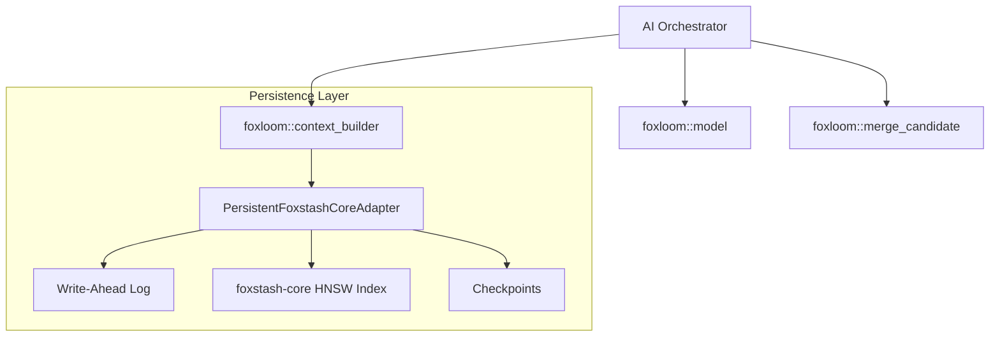

# foxloom

[](https://crates.io/crates/foxloom)
[](https://docs.rs/foxloom)
[](https://opensource.org/licenses/MIT)

**foxloom** is a hybrid memory layer for AI agents, bringing **mem0-style** semantic memory logic to the high-performance **foxstash-core** vector engine. It handles the "logic of remembering"—deciding when to add new facts, update existing ones, or supersede outdated information.

## Key Features

*   **Semantic Memory Model**: Rich `MemoryRecord` schema supporting multi-tenant scopes (User, Session, Workspace, Global) and diverse memory types (Profile, Episodic, Policy).
*   **Deterministic Merging**: Intelligent `merge_candidate` logic that handles deduplication and entity-aware superseding (e.g., "The server is down" -> "The server is back up").
*   **Industrial-Grade Persistence**: Built-in `PersistentFoxstashCoreAdapter` with Write-Ahead Logging (WAL), atomic checkpointing, and automatic background recovery.
*   **Recency Decay**: Advanced `decayed_importance` scoring that gracefully de-prioritizes older memories based on configurable half-lives.
*   **Budgeted Context**: A deterministic prompt-context builder that fills your LLM context window based on word budgets, ensuring the most relevant memories are always included without clipping.
*   **High Performance**: Native integration with `foxstash-core` utilizing SIMD-accelerated HNSW indexing and optional ONNX-based local embeddings.

## Installation

Add this to your `Cargo.toml`:

```toml
[dependencies]
foxloom = "0.2"
```

For local ONNX embedding support (requires `ort` setup):

```toml
[dependencies]
foxloom = { version = "0.2", features = ["onnx-embedder"] }
```

## Quick Start

### 1. Persistent Memory Store
Initialize a reliable, disk-backed memory store in just a few lines.

```rust
use foxloom::{PersistentFoxstashCoreAdapter, PersistentConfig, FoxstashAdapter};
use std::path::Path;

fn main() -> Result<(), String> {
    let storage_path = "./fox_memory";
    let config = PersistentConfig::default();

    // 64-dimensional deterministic embedder (or use OnnxEmbedder)
    let adapter = PersistentFoxstashCoreAdapter::new(64, storage_path, config)?;

    // Upsert a memory with metadata
    adapter.upsert_embedding(
        "id-1", 
        "The project is using Rust 1.80", 
        serde_json::json!({"entity": "rust_version", "scope": "workspace"})
    )?;

    // Force a disk sync
    adapter.sync()?;
    
    Ok(())
}
```

### 2. Intelligent Merging
Foxloom knows when a fact is new or a correction of an old one.

```rust
use foxloom::{merge_candidate, MemoryRecord, MemoryScope, MemoryType, MemoryOp};
use uuid::Uuid;

let existing = MemoryRecord::new(Uuid::new_v4(), MemoryScope::Session, MemoryType::Episodic, "The meeting is at 2pm".to_string());
let candidate = MemoryRecord::new(Uuid::new_v4(), MemoryScope::Session, MemoryType::Episodic, "The meeting is moved to 3pm".to_string());

// Foxloom identifies this as a potential superseding event if entities match
let op = merge_candidate(Some(&existing), &candidate);
match op {
    MemoryOp::Supersede { .. } => println!("Updating the meeting time!"),
    _ => println!("Added as a separate fact."),
}
```

## Architecture

Foxloom acts as the "Pre-Processor" and "Storage Manager" for your agent's brain.



## Documentation

*   [**Start Here**](docs/START-HERE.md) - A 15-minute guide to your first implementation.
*   [**Architecture**](docs/ARCHITECTURE.md) - Deep dive into module boundaries and data flow.
*   [**Memory Model**](docs/MEMORY-MODEL.md) - Details on record schema and merge semantics.
*   [**Retrieval & Context**](docs/RETRIEVAL-AND-CONTEXT.md) - How ranking and decay work.
*   [**API Reference**](docs/API-REFERENCE.md) - Full public API surface.

## Local ONNX Assets

The `onnx-embedder` feature requires local model and tokenizer files. For development, we recommend storing them in a `.models/` directory (which is git-ignored by default in this repo).

## License

MIT © [Narcoleptic-Fox](https://github.com/Narcoleptic-Fox)
