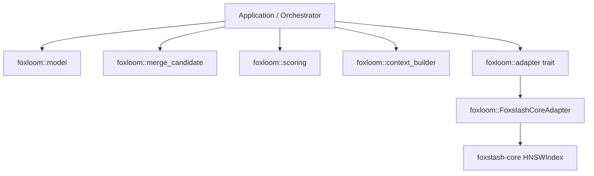
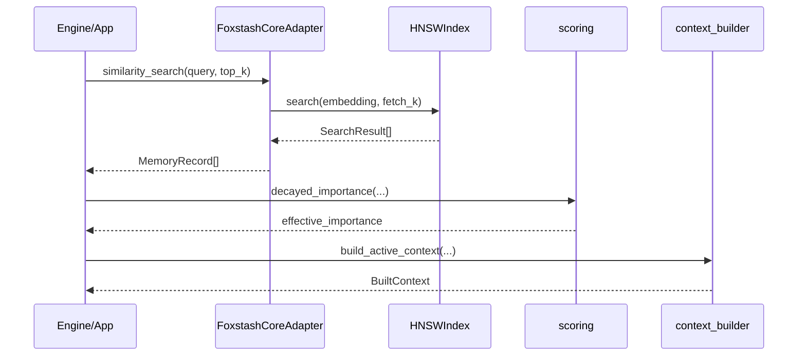

# Architecture

## Module Layout

- `src/model.rs`: canonical types and operations.
- `src/scoring.rs`: recency decay scoring.
- `src/context_builder.rs`: deterministic budgeted context formatting.
- `src/adapter.rs`: vector adapter trait contract.
- `src/foxstash_adapter.rs`: `foxstash-core` adapter implementation.
- `src/lib.rs`: public exports and merge entrypoint.

## High-Level Components

## Typical Runtime Data Path

## Determinism Guarantees

- Context ordering is stable by:
  - scope precedence (`workspace -> session -> user -> global`)
  - descending score
  - UUID tie-break (`memory_id` as u128)
- Adapter retrieval has deterministic tie handling with id-based ordering.
- Retrieval widening is bounded (`8x top_k` cap) to avoid runaway fetch loops.
