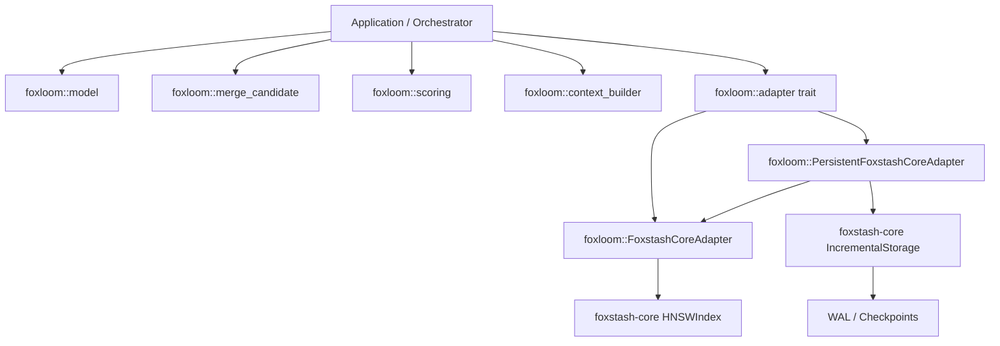
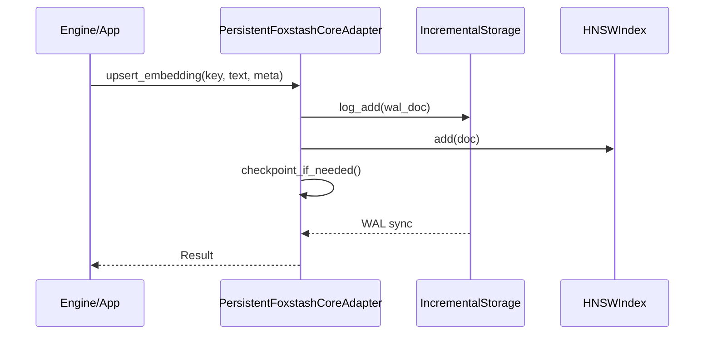

# Architecture

## Module Layout

- `src/model.rs`: canonical types and operations.
- `src/scoring.rs`: recency decay scoring.
- `src/context_builder.rs`: deterministic budgeted context formatting.
- `src/adapter.rs`: vector adapter trait contract.
- `src/foxstash_adapter.rs`: `foxstash-core` adapter implementation and persistent adapter.
- `src/lib.rs`: public exports and merge entrypoint.

## High-Level Components

## Typical Runtime Data Path (Persistent)

## Persistence Design

- **WAL (Write-Ahead Log)**: Every modification is logged to disk before being applied to the in-memory HNSW index.
- **Checkpoints**: The entire active document set is periodically serialized to a checkpoint file, allowing the WAL to be truncated.
- **Recovery**: On startup, the adapter loads the latest checkpoint and replays any subsequent WAL entries to restore the index state.
- **Compaction**: Deletions in HNSW are handled via tombstones. The persistent adapter automatically rebuilds the index from active documents once a deletion threshold is met.

## Determinism Guarantees

- Context ordering is stable by:
  - scope precedence (`workspace -> session -> user -> global`)
  - descending score
  - UUID tie-break (`memory_id` as u128)
- Adapter retrieval has deterministic tie handling with id-based ordering.
- Retrieval widening is bounded (`8x top_k` cap) to avoid runaway fetch loops.
