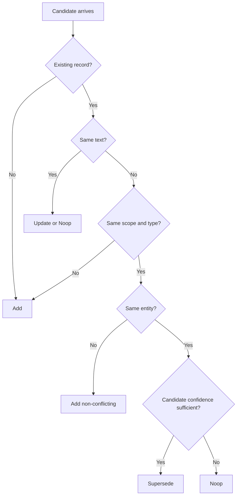

# Memory Model

## Core Types

`MemoryRecord` fields:

- identity: `memory_id`
- scope linkage: `workspace_id`, `user_id`, `session_id`
- semantics: `scope`, `memory_type`, `status`
- content: `text`, `json_fields`
- ranking: `confidence`, `importance`, `decay_half_life_hours`
- lineage/provenance: `source_run_id`, `updated_at`, `embedding_ref`

## Enumerations

- `MemoryScope`: `user | session | workspace | global`
- `MemoryType`: `profile | episodic | policy | artifact_summary`
- `MemoryStatus`: `active | superseded | quarantined | deleted`

## Operation Model (`MemoryOp`)

- `Add { record, reason }`
- `Update { memory_id, patch, reason }`
- `Supersede { old_memory_id, new_record, reason }`
- `Delete { memory_id, reason }`
- `Noop { memory_id, reason }`

## Merge Semantics (Default Helper)

`merge_candidate(existing, candidate)` behavior:

1. No existing record -> `Add`.
2. Exact text duplicate -> `Update` confidence/importance (or `Noop`).
3. Scope/type mismatch -> `Add`.
4. Non-active states are protected from unsafe supersede.
5. Entity-aware replacement when `json_fields.entity` matches.

