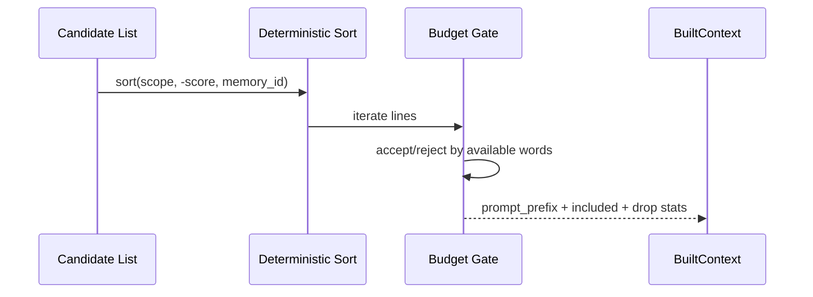

# Retrieval And Context

## Adapter Retrieval (`FoxstashCoreAdapter`)

`similarity_search(query, top_k, metadata_filter)`:

- Embeds query using configured embedder.
- Searches index with widening fetch windows.
- Applies tombstones and metadata filter.
- Deduplicates IDs and maps records from metadata.
- Stops when enough records are found or cap reached.

### Retrieval Widening

- Starts at `fetch_k = top_k`.
- Doubles each iteration.
- Hard cap: `min(total_docs, top_k * 8)`.

```mermaid
flowchart TD
    A[Start search] --> B[fetch_k = top_k]
    B --> C[Index search]
    C --> D[Filter tombstones + metadata]
    D --> E{out.len >= top_k?}
    E -- Yes --> F[Return top_k]
    E -- No --> G{fetch_k >= cap?}
    G -- Yes --> F
    G -- No --> H[fetch_k = min(fetch_k*2, cap)]
    H --> C
```

## Decay Scoring

`decayed_importance(base, half_life, age_hours, cfg)`:

- Clamp base importance to `[0,1]`.
- If half-life missing and no default: no decay.
- If half-life is `0`: immediate floor.
- Else: exponential decay by half-life.
- Final clamp to `[importance_floor, 1.0]`.

```mermaid
flowchart LR
    A[base_importance] --> B{half_life?}
    B -- None --> C[use base]
    B -- Some 0 --> D[use floor]
    B -- Some h --> E[factor = 2^(-age/h)]
    E --> F[base * factor]
    C --> G[clamp floor..1.0]
    D --> G
    F --> G
```

## Context Builder

`build_active_context(candidates, budget, cfg)`:

- Sorts deterministically by scope, score, and UUID.
- Applies hard budget (no partial memory lines).
- Optionally emits headers and `why` metadata tags.
- Returns `BuiltContext` with `dropped_count` and `drop_reasons`.


