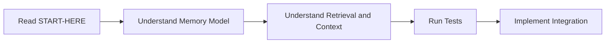

# Start Here

This guide gets you productive in under 15 minutes.

## What Foxloom Is

`foxloom` is a Rust memory library that provides:

- A canonical memory model (`MemoryRecord`, `MemoryOp`).
- Merge semantics for add/update/supersede/noop decisions.
- Decay scoring (`decayed_importance`) for recency-aware ranking.
- Deterministic active context builder under strict budget.
- Reliable **Persistence** with WAL and recovery support.
- A `foxstash-core` adapter for vector upsert/search/delete.

## Quick Install

```toml
[dependencies]
foxloom = "0.2"
```

Optional ONNX embedder support:

```toml
[dependencies]
foxloom = { version = "0.2", features = ["onnx-embedder"] }
```

## Persistent Storage Example

For production use cases, use the `PersistentFoxstashCoreAdapter` to ensure memories survive application restarts.

```rust
use foxloom::{PersistentFoxstashCoreAdapter, PersistentConfig, FoxstashAdapter};
use std::path::Path;

let storage_path = "./memory_db";
let config = PersistentConfig::default();

// Initialize or recover from path
let adapter = PersistentFoxstashCoreAdapter::new(384, storage_path, config)
    .expect("failed to open memory store");

adapter.upsert_embedding(
    "id-123",
    "The user prefers dark mode",
    serde_json::json!({"scope": "user", "memory_type": "profile"})
).expect("save failed");

// Ensure data is synced to disk
adapter.sync().expect("sync failed");
```

## Minimal End-to-End Example (Logic)

```rust
use foxloom::{
    build_active_context, merge_candidate, ContextBudget, ContextBuildConfig, ContextItem,
    DecayConfig, MemoryRecord, MemoryScope, MemoryType, decayed_importance,
};
use uuid::Uuid;

let mut record = MemoryRecord::new(
    Uuid::new_v4(),
    MemoryScope::Session,
    MemoryType::Episodic,
    "Primary region is us-east-1".to_string(),
);
record.importance = 0.9;

let effective = decayed_importance(
    record.importance,
    record.decay_half_life_hours,
    24.0,
    &DecayConfig::default(),
);

let candidate = MemoryRecord::new(
    Uuid::new_v4(),
    MemoryScope::Session,
    MemoryType::Episodic,
    "Primary region is us-east-1".to_string(),
);
let _op = merge_candidate(Some(&record), &candidate);

let built = build_active_context(
    &[ContextItem {
        memory_id: record.memory_id,
        text: record.text.clone(),
        memory_type: record.memory_type.clone(),
        scope: record.scope.clone(),
        similarity: 0.92,
        confidence: record.confidence,
        importance: effective,
        score: 0.98,
        source: "vector_search".to_string(),
    }],
    &ContextBudget { max_words: 220, reserve_words: 40 },
    &ContextBuildConfig { include_headers: true, include_why: false },
);

assert!(!built.prompt_prefix.is_empty());
```

## Onboarding Flow


