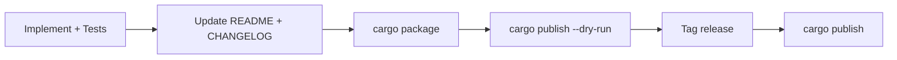

# Testing And Release

## Local Validation

Run from repo root:

```bash
cargo fmt --all
cargo test -- --nocapture
cargo package
cargo publish --dry-run
```

Optional ONNX-enabled validation (requires model/tokenizer + runtime setup):

```bash
cargo test --features onnx-embedder -- --nocapture
```

## Local ONNX Assets

- Keep local model files under `.models/`.
- `.models/` is gitignored.
- Crate does not ship model assets.

## Release Workflow



## Post-Publish Checklist

- Confirm docs.rs build for the new version.
- Validate crate page metadata and links.
- Bump downstream consumers (for example `den-engine`).
- Archive parity test output for release notes.
